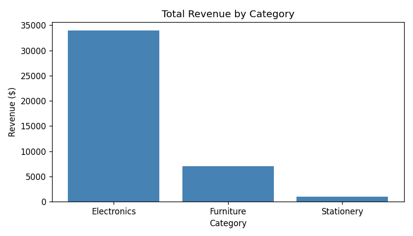
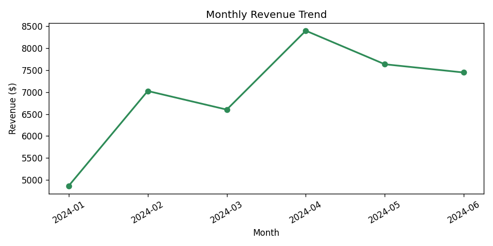

# Pandas Data Analysis

A beginner-friendly data analysis project using **Python** and **Pandas** to clean, explore, and interpret structured sales data.  
The project covers the full data analysis workflow — from raw CSV to actionable insights and charts.

---

## Objective

Practice core data analysis skills including:

- **Data loading** — reading a CSV file into a Pandas DataFrame
- **Data cleaning** — handling missing values, duplicates, and data types
- **Data exploration** — shape, dtypes, summary statistics, and unique values
- **Pattern & trend analysis** — groupby aggregations across product, category, region, and time
- **Visualisation** — bar charts, line charts, and histograms saved as PNG files

---

## Dataset

`data/sales_data.csv` contains **72 sales transactions** from January – June 2024.

| Column | Description |
|---|---|
| `date` | Transaction date |
| `product` | Product name |
| `category` | Product category (Electronics, Furniture, Stationery) |
| `quantity` | Units sold |
| `unit_price` | Price per unit ($) |
| `region` | Sales region (North, South, East, West) |
| `customer_age` | Customer age |
| `customer_gender` | Customer gender (M / F) |

Two `quantity` values are intentionally left blank to demonstrate missing-value handling.

---

## Tools Used

- Python 3
- [Pandas](https://pandas.pydata.org/) — data manipulation and analysis
- [Matplotlib](https://matplotlib.org/) — data visualisation

---

## Project Structure

```
pandas-data-analysis/
├── data/
│   └── sales_data.csv       # Raw dataset
├── output/                  # Generated charts (created on first run)
│   ├── revenue_by_category.png
│   ├── top_products.png
│   ├── monthly_revenue_trend.png
│   ├── revenue_by_region.png
│   └── customer_age_distribution.png
├── analysis.py              # Main analysis script
└── README.md
```

---

## How to Run

1. **Install dependencies**

   ```bash
   pip install pandas matplotlib
   ```

2. **Run the analysis**

   ```bash
   python analysis.py
   ```

   The script prints results to the console and saves five charts to the `output/` directory.

---

## Key Findings

| Insight | Value |
|---|---|
| Total transactions analysed | 72 |
| Total revenue | $41,964.48 |
| Best-performing category | Electronics (81% of revenue) |
| Best-selling product | Laptop |
| Top revenue region | East |
| Monthly revenue peak | April 2024 |

---

## Sample Charts

### Revenue by Category


### Monthly Revenue Trend

